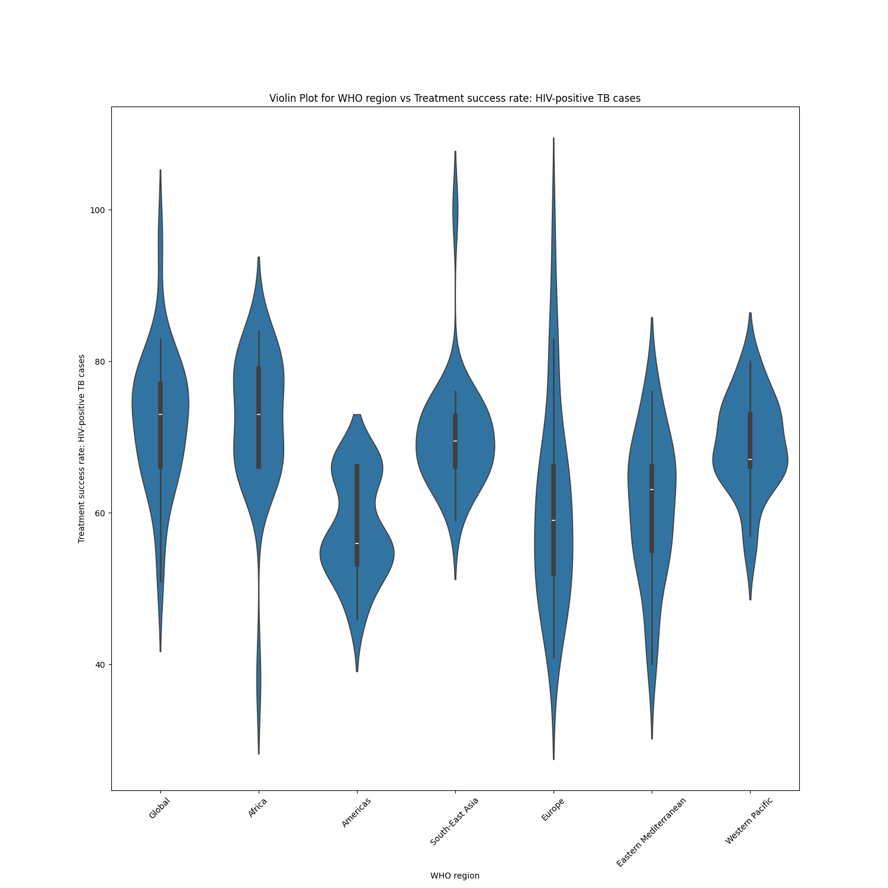

# Tuberculosis Treatment Success Rate 

The aim of this analysis is to investigate the trends and disparities in tuberculosis (TB) treatment success rates across various WHO regions from 1995 to 2020. By utilizing the provided dataset, the objective is to identify patterns, assess the effectiveness of interventions, and understand the factors influencing TB treatment outcomes. Specifically, the study aims to explore variations in treatment success rates among different types of TB cases and geographical regions. Through this analysis, the goal is to gain valuable insights that can inform evidence-based policies and interventions to enhance TB treatment outcomes worldwide.

# Data Set

## Overview 

This dataset contains information about tuberculosis (TB) treatment success rates across different regions and years. It includes data on new TB cases, previously treated TB cases, HIV-positive TB cases, multidrug-resistant TB (MDR-TB) cases, and extensively drug-resistant TB (XDR-TB) cases. The data is organized by the World Health Organization (WHO) regions: Global, Africa, Americas, South-East Asia, Europe, Eastern Mediterranean, and Western Pacific.

## Features Explination 

Features :

1. WHO Region (DataType : Object) : The region to which the data belongs (e.g., Global, Africa, Americas, etc.).
2. Year (DataType : INT64) : The year in which the data was recorded.
3. Treatment Success Rate for New TB Cases  (DataType : INT64) : successful treatment outcomes for new TB cases.
4. Treatment Success Rate for Previously Treated TB Cases  (DataType : INT64) : successful treatment outcomes for previously treated TB cases.
5. Treatment Success Rate for HIV-Positive TB Cases (DataType : FLOAT64) : successful treatment outcomes for TB cases in patients who are HIV-positive.
6. Treatment Success Rate for Patients Treated for MDR-TB (%) (DataType : FLOAT64) : Percentage of successful treatment outcomes for multidrug-resistant TB (MDR-TB) cases.
7. Treatment Success Rate for XDR-TB Cases (DataType : FLOAT64) :successful treatment outcomes for extensively drug-resistant TB (XDR-TB) cases.


# Setup

```python
# Install the requirements.txt packages.
$ pip3 install -r requirements.txt
```
# Usage

Terms:

1. input_file_path: Absolute File Path of the input csv file.
2. output_file_path: Directory for storring the plots.


```python
>>> python3 run.py input_file_path output_file_path
```

# Visualizing Data

## Plot 1
The provided count plot illustrates the distribution of the "WHO region" feature across seven distinct classes: Global, Africa, America, South-East Asia, Europe, Eastern Mediterranean, and Western Pacific. Each class is evenly distributed, indicating an equal representation within the dataset. The x-axis represents the different WHO regions, while the y-axis indicates the count of occurrences for each specific region. This visualization provides a clear overview of the balanced distribution of data points among the WHO regions, highlighting the equal representation of each region within the dataset.


## Plot 2

A correlation heatmap is a graphical representation of the correlation matrix, showing how strongly different variables are related to one another. This visualization technique is particularly useful in statistics, data analysis, and machine learning to identify patterns, trends, and relationships within datasets.

Here's a detailed explanation of correlation heatmap:

### Understanding Correlation:

Correlation measures the strength and direction of a linear relationship between two variables. It ranges from -1 to 1:

-   Positive Correlation (1):   When one variable increases, the other variable tends to increase as well.
-   Negative Correlation (-1):   When one variable increases, the other variable tends to decrease.
-   No Correlation (0):   There is no linear relationship between the variables.


## Observations : From the heat map we can observe that,

1. The correlation coefficient of 0.54 between Year and New TB Cases indicates a positive relationship, signifying that the number of new TB cases is consistently increasing year by year.

2. Similarly, the correlation also applies to treated TB cases, suggesting a steady rise in the number of TB cases being treated annually.


## Plot 3

A histogram for the count of years in a dataset visually displays how frequently each year appears. Each bar represents a year, and its height indicates how many times that year occurs in the data. It provides a clear snapshot of the dataset's temporal distribution, helping to identify prevalent years and patterns quickly.

## Observartions:

The histogram reveals essential insights about the dataset. Firstly, it indicates that, on average, there are more than 13 reportings for each year. This suggests a consistent level of data collection and reporting activity across the years.

Furthermore, during the period from 2015 to 2020, there is a noteworthy trend: the number of reportings significantly surpasses 20. This specific range of years stands out due to a higher frequency of data points, indicating a substantial increase in reporting activities. 


## Plot 4

A pair plot is a graphical representation in data analysis, showing scatter plots for variables in a dataset, organized in a grid. It compares every variable with every other variable, displaying correlations and distributions at once. Pair plots help identify patterns, relationships, and outliers in multivariate data, aiding in comprehensive insights.


## Plot 5


A violin plot is a method of plotting numeric data and can be particularly useful when comparing the distribution of a numerical variable across different categories. In wer case, we want to create a violin plot to compare the treatment success rates of HIV-positive cases across different WHO regions. Here's how we can interpret it:

## Observations:

1. In Africa, the average success rate for treating HIV-positive cases hovers around 75%. The distribution appears slim, indicating consistency in these rates over time.

2. In the Americas, the picture is different. Treatment success rates vary widely, resulting in a bulky distribution. On average, about 60% of cases are successfully treated.

3. For Europe, Eastern Mediterranean, and South-East Asia, the average success rates reside in the mid-60s. These regions exhibit slender distributions, suggesting relatively stable treatment outcomes.
4.
5. The Western Pacific region contrasts with a thicker distribution, indicating more variability in treatment success rates. On average, around 65% of cases are treated successfully here.


## Plot 6

A box plot, also known as a box-and-whisker plot, is a graphical representation of the distribution of a dataset. It shows the minimum, first quartile, median (second quartile), third quartile, and maximum of a dataset. When comparing the treatment success rates of new TB cases across different WHO regions using a box plot, here's how we can interpret:

1. The Western Pacific region reports the highest average number of TB cases, with the Eastern Mediterranean following closely in second place.

2. South-East Asia exhibits a larger box in the box plot, indicating a wider range of reported cases. On average, this region reports around 83 cases.

3. In contrast, both Europe and the Americas show smaller boxes, representing a narrower range of reported cases. The average number of cases reported in these regions is about 75.

4. Africa's box plot appears standard, with the median line precisely at 75. This suggests a typical range of reported cases in this region. 


## Plot 7

## Obeservations:
A bar plot is a common way to represent categorical data. In wer case, we want to create a bar plot to compare the treatment success rates of XDR TB (Extensively Drug-Resistant Tuberculosis) cases across different WHO regions. 

1. A bigger bar for the Western Pacific region suggests a higher treatment success rate for XDR TB cases in this region.

2. A smaller bar for the Europe region indicates a comparatively lower treatment success rate for XDR TB cases in this region.


