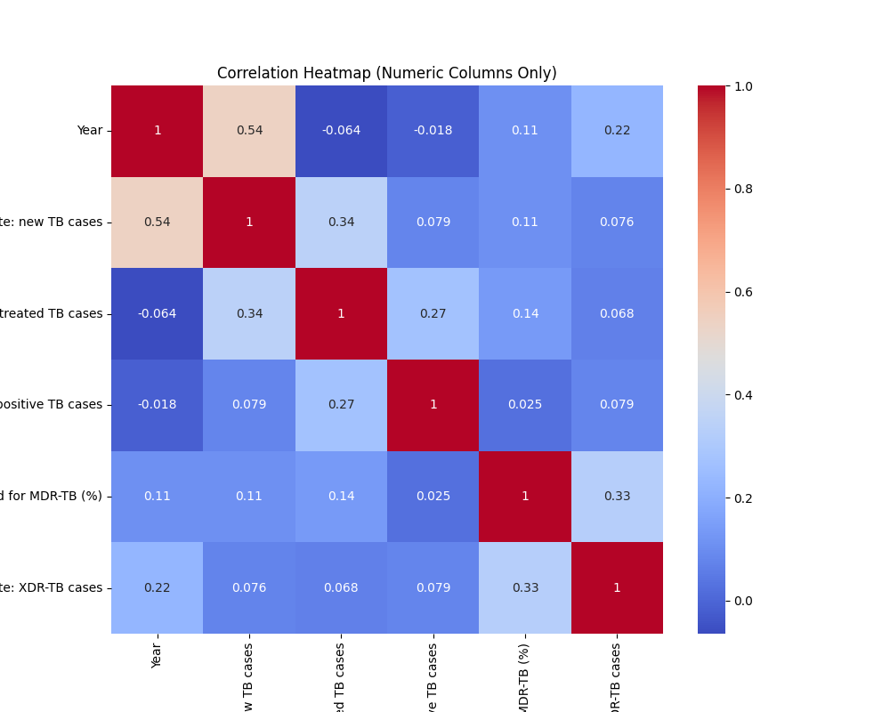

# Tuberculosis Treatment Success Rate 

# Data Set

## Overview 

This dataset contains information about tuberculosis (TB) treatment success rates across different regions and years. It includes data on new TB cases, previously treated TB cases, HIV-positive TB cases, multidrug-resistant TB (MDR-TB) cases, and extensively drug-resistant TB (XDR-TB) cases. The data is organized by the World Health Organization (WHO) regions: Global, Africa, Americas, South-East Asia, Europe, Eastern Mediterranean, and Western Pacific.

## Features Explination 

Features :

1. WHO Region: The region to which the data belongs (e.g., Global, Africa, Americas, etc.).
2. Year: The year in which the data was recorded.
3. Treatment Success Rate for New TB Cases: Percentage of successful treatment outcomes for new TB cases.
4. Treatment Success Rate for Previously Treated TB Cases: Percentage of successful treatment outcomes for previously treated TB cases.
5. Treatment Success Rate for HIV-Positive TB Cases: Percentage of successful treatment outcomes for TB cases in patients who are HIV-positive.
6. Treatment Success Rate for Patients Treated for MDR-TB (%): Percentage of successful treatment outcomes for multidrug-resistant TB (MDR-TB) cases.
7. Treatment Success Rate for XDR-TB Cases: Percentage of successful treatment outcomes for extensively drug-resistant TB (XDR-TB) cases.


# Setup

```python
# Install the requirements.txt packages.
$ pip3 install -r requirements.txt
```
# Usage

Terms:

1. input_file_path: Absolute File Path of the input csv file.
2. output_file_path: Directory for storring the plots.


```python
>>> python3 run.py input_file_path output_file_path
```

# Visualizing Data

## Plot 1
The provided count plot illustrates the distribution of the "WHO region" feature across seven distinct classes: Global, Africa, America, South-East Asia, Europe, Eastern Mediterranean, and Western Pacific. Each class is evenly distributed, indicating an equal representation within the dataset. The x-axis represents the different WHO regions, while the y-axis indicates the count of occurrences for each specific region. This visualization provides a clear overview of the balanced distribution of data points among the WHO regions, highlighting the equal representation of each region within the dataset.


## Plot 2

A correlation heatmap is a graphical representation of the correlation matrix, showing how strongly different variables are related to one another. This visualization technique is particularly useful in statistics, data analysis, and machine learning to identify patterns, trends, and relationships within datasets.

Here's a detailed explanation of correlation heatmap:

### Understanding Correlation:

Correlation measures the strength and direction of a linear relationship between two variables. It ranges from -1 to 1:

-   Positive Correlation (1):   When one variable increases, the other variable tends to increase as well.
-   Negative Correlation (-1):   When one variable increases, the other variable tends to decrease.
-   No Correlation (0):   There is no linear relationship between the variables.

### Correlation Matrix:

In data analysis, you often deal with multiple variables. A correlation matrix is a table that shows the correlation coefficients between many variables. Each cell in the table represents the correlation between two variables.

### Correlation Heatmap:

A correlation heatmap takes the correlation matrix and visualizes it using colors. The heatmap provides a quick and easy way to identify patterns in the data. Here's how it works:

-   Color Gradient:   The heatmap assigns a color gradient to the correlation values. Commonly, warm colors like red or orange represent positive correlations, while cool colors like blue represent negative correlations.
  
-   Intensity of Color:   The intensity or darkness of the color indicates the strength of the correlation. Stronger correlations (closer to -1 or 1) appear darker, making it easy to spot significant relationships in the data.

-   Axes Labels:   The heatmap has the variables on both the X and Y axes, making it easy to identify which variables are being compared.




## Plot 3

A histogram for the count of years in a dataset visually displays how frequently each year appears. Each bar represents a year, and its height indicates how many times that year occurs in the data. It provides a clear snapshot of the dataset's temporal distribution, helping to identify prevalent years and patterns quickly.


## Plot 4


## Plot 5


## Plot 6


## Plot 7


